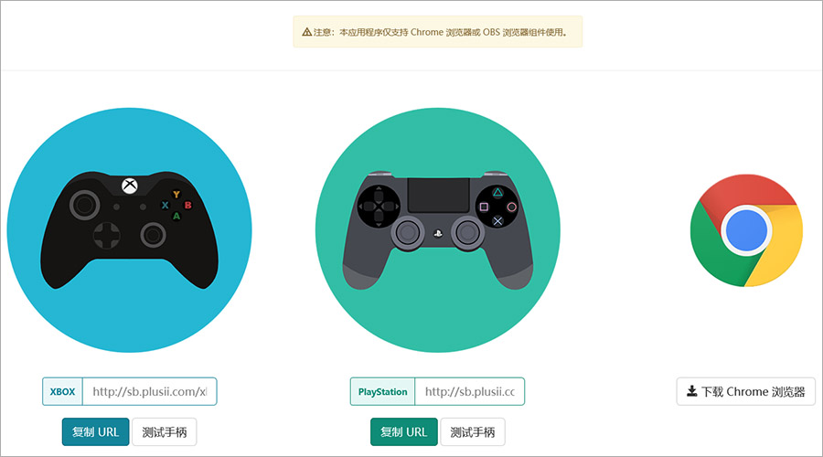
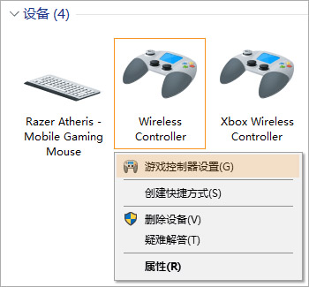
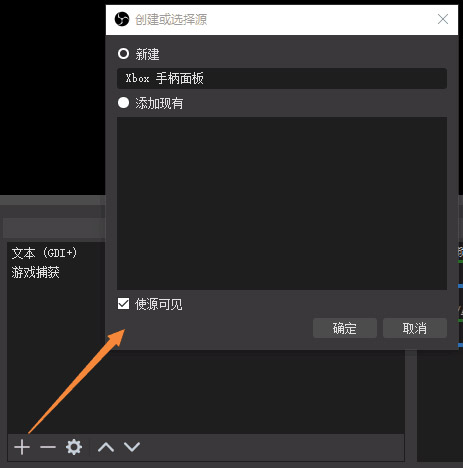
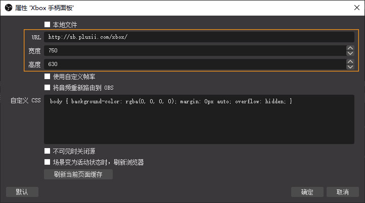
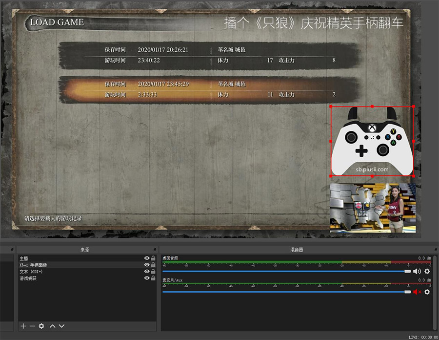
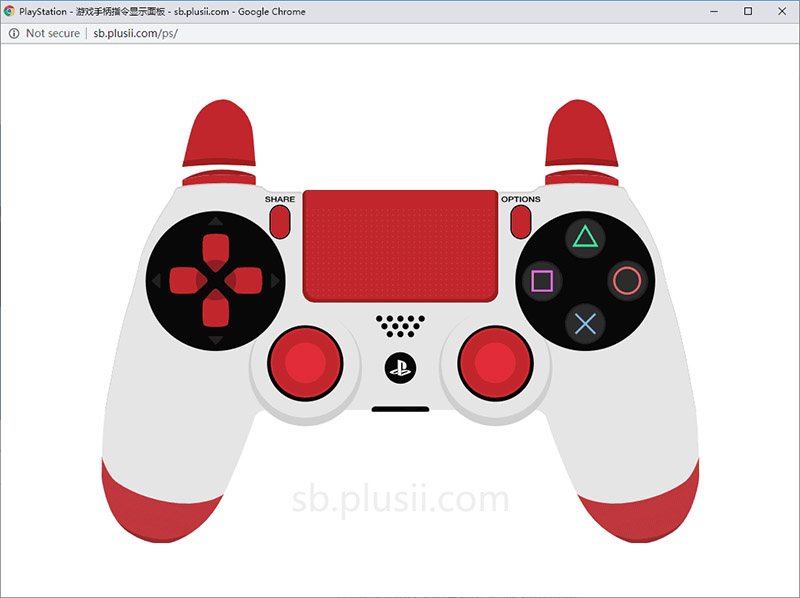

# 游戏手柄指令显示面板
本项目的开发基础是`gamepadviewer.com`，以资源本地化和使用便利性为核心目标，创建更能配合国内游戏直播需求的辅助工具。
本应用程序提供的虚拟手柄面板与直播软件捕获的游戏画面组合，使观众更容易理解主播对游戏的操作，提升直播中的交互效率。

## 原理简介
本应用程序利用`Chrome`原生支持游戏手柄指令的特性，构建可视化的虚拟游戏手柄面板来显示实时的操作指令。
直播软件 [OBS Studio] 内置的 [obs-browser] 插件本质上是一个基于 Chrome 内核的网页浏览器外壳；
因此，只要在 OBS 中添加一个 `浏览器` 组件，就相当于在直播画面中常驻了一个微型的 Chrome 窗口，设定好来源 URL，使其显示本应用程序的画面。

## 主要功能特性
> 1. 支持 Xbox 手柄面板和实时指令显示；
> 2. 支持 PlayStation 手柄面板和实时指令显示；
> 3. 支持 `OBS Studio Browser Plugin` 插件整合 `Open Broadcaster Software (OBS)` 直播推流；
> 4. 支持 `Chrome 浏览器` 测试手柄；
> 5. 高实时性：纯客户端应用，启用后在本地运行，不依赖服务器和网络；
> 6. 高扩展性：跟随 Chrome 内核升级可原生支持更多手柄类型；
> 7. 高兼容性：支持所有主流直播平台。  

  
  
  
## OBS 直播手柄面板使用步骤
1. 将游戏手柄连接到计算机。参考下述连接方式：

|手柄类型              |有线连接    |蓝牙连接    |适配器连接   |
|-------              |-------    |-------    |-------     |
|Xbox One S           |支持        |支持       |支持         |
|Xbox One (或早期)     |支持        |不支持     |支持         |
|DualShock 4          |支持        |支持       |支持         |
|DualShock 3 (或早期)  |支持        |不支持     |不支持       |

*注：微软第二代适配器仅支持 Windows 10；而某些第三方适配器即兼容多个操作系统，又支持多种手柄类型。*

2. 确认手柄已经被系统识别。打开`设备和打印机`可以设置游戏控制器。  

3. 使用 Chrome 浏览器打开应用主页: http://sb.plusii.com/
4. 找到正确的手柄图示，点击`复制 URL`。
5. 打开 OBS 直播软件，新建一个`浏览器`来源，并设置名称、URL、宽度、高度等参数。  
  
  

6. 最后调整好手柄尺寸和位置，开播！  

  
  
  
## Chrome 浏览器测试手柄步骤
1. 参照上节步骤连接好游戏手柄。
2. 使用 Chrome 浏览器打开应用主页: http://sb.plusii.com/
3. 找到正确的手柄图示，点击`测试手柄`。  

4. 在弹出的对话框中启动测试。  

  
  
## 常见问题
1. 

  
  
-------------------------------------------------  
使用中有任何问题和建议，欢迎 [在此留爪] 或 QQ [9812152]。  

[OBS Studio]: https://obsproject.com/
[obs-browser]: https://obsproject.com/forum/resources/browser-plugin.115/
[在此留爪]: https://github.com/HeddaZ/shoubing/issues
[9812152]: tencent://message/?uin=9812152